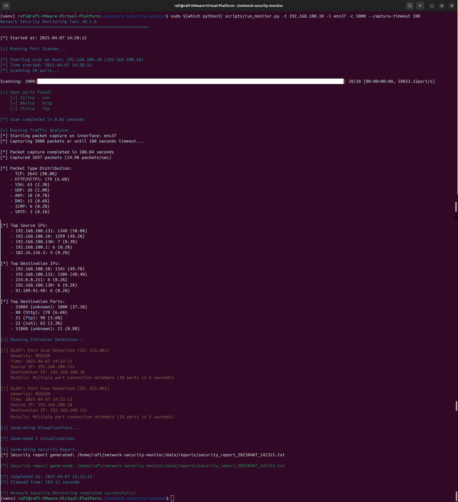
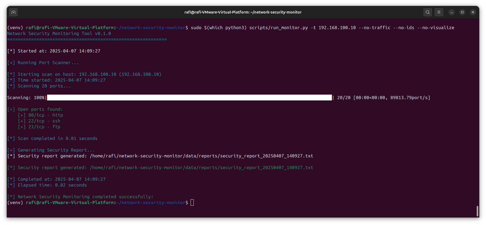
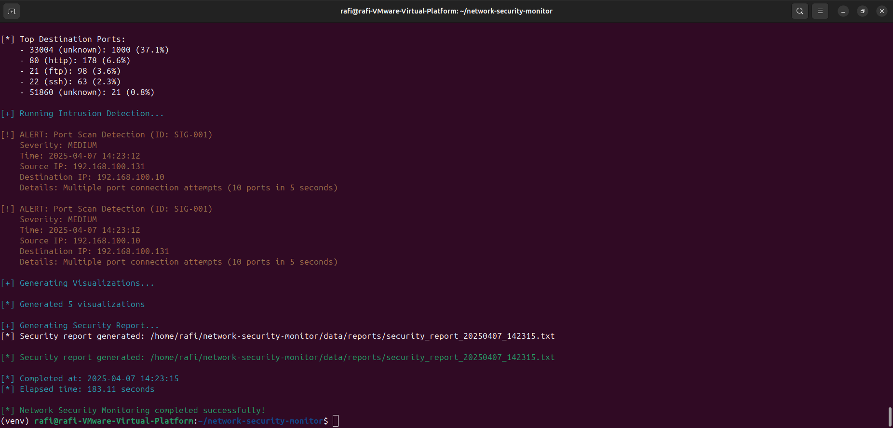
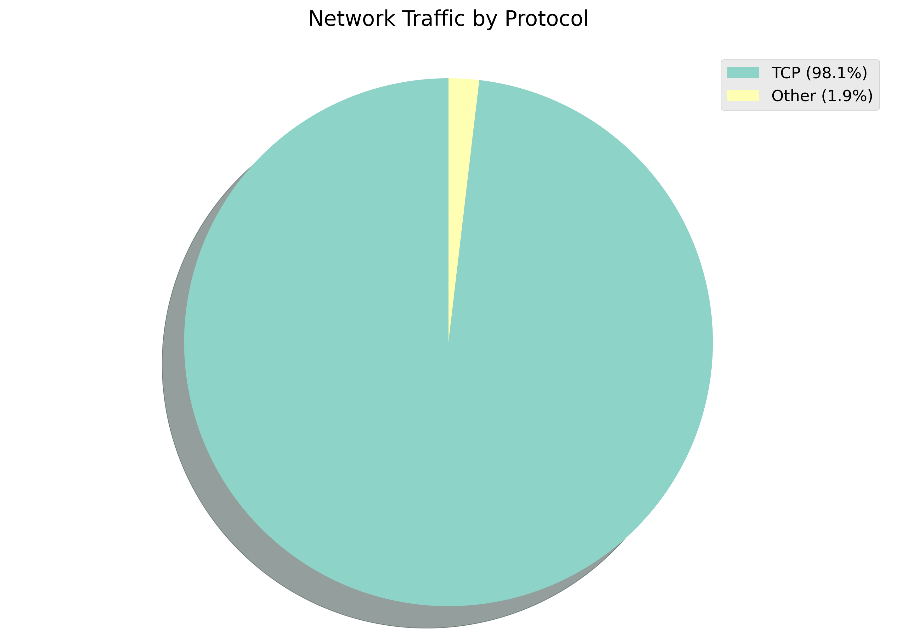
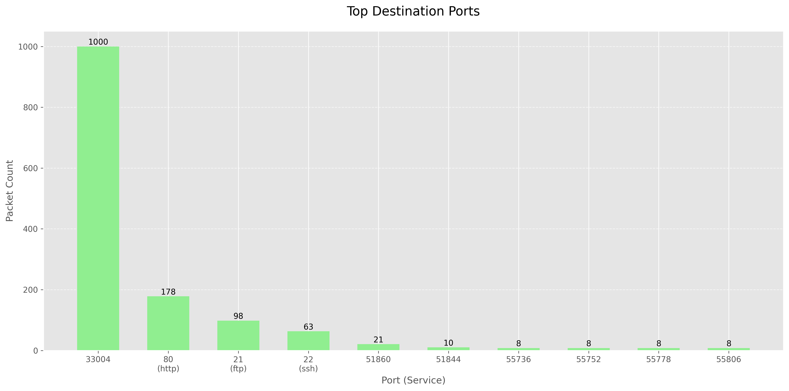
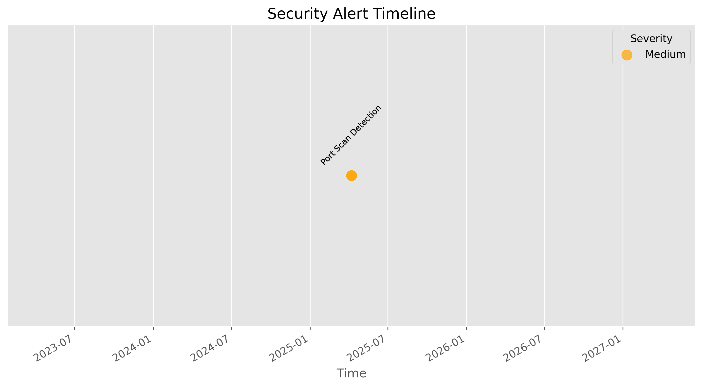

# Network Security Monitoring Tool

A comprehensive Python-based tool for network security monitoring, vulnerability detection, and traffic analysis.



[](https://www.python.org/downloads/)
[](LICENSE)

## Table of Contents
- [Overview](#overview)
- [Features](#features)
- [Architecture](#architecture)
- [Installation](#installation)
- [Usage](#usage)
- [Test Environment](#test-environment)
- [Security Monitoring Examples](#security-monitoring-examples)
- [Visualizations](#visualizations)
- [Report Examples](#report-examples)
- [Contributing](#contributing)
- [License](#license)

## Overview

This Network Security Monitoring Tool provides real-time detection and analysis of network security threats using multiple monitoring techniques. Designed for cybersecurity students, professionals, and enthusiasts, it delivers enterprise-grade monitoring capabilities in a straightforward package.

## Features

- **🔍 Port Scanning**: Detect open ports and identify running services
- **📊 Traffic Analysis**: Monitor and categorize network traffic by protocol and packet type
- **🚨 Intrusion Detection**: Identify suspicious activities like port scans in real-time
- **📈 Visualization**: Generate comprehensive traffic analysis charts
- **📝 Reporting**: Create detailed security reports in multiple formats (TXT, JSON, CSV)

## Architecture

The tool is built with a modular architecture:

```
network-security-monitor/
├── netsecmonitor/
│   ├── port_scanner.py        # Port scanning functionality
│   ├── traffic_analyzer.py    # Traffic capture and analysis
│   ├── intrusion_detection.py # IDS capabilities
│   ├── visualization.py       # Data visualization 
│   ├── reporting.py           # Report generation
│   └── utils/                 # Helper utilities
├── data/
│   ├── signatures/            # IDS signatures
│   ├── reports/               # Generated reports
│   └── charts/                # Generated visualizations
└── scripts/
    └── run_monitor.py         # Main execution script
```

## Installation

### Prerequisites
- Python 3.6+
- Linux-based system
- Network adapter with promiscuous mode capability

### Setup

1. Clone the repository:
   ```bash
   git clone https://github.com/yourusername/network-security-monitor.git
   cd network-security-monitor
   ```

2. Create a virtual environment:
   ```bash
   python3 -m venv venv
   source venv/bin/activate
   ```

3. Install dependencies:
   ```bash
   sudo apt-get update
   sudo apt-get install -y python3-dev build-essential
   pip install -r requirements.txt
   ```

4. Make the main script executable:
   ```bash
   chmod +x scripts/run_monitor.py
   ```

## Usage

### Port Scanning

Scan a target host for open ports:

```bash
python scripts/run_monitor.py -t <target_ip> --no-traffic --no-ids --no-visualize
```



### Traffic Analysis

Monitor network traffic on an interface:

```bash
sudo $(which python3) scripts/run_monitor.py -i <interface> -c 2000 --no-scan
```

### Comprehensive Security Monitoring

Run all modules together:

```bash
sudo $(which python3) scripts/run_monitor.py -t <target_ip> -i <interface> -c 5000
```

### Command-Line Options

| Option | Description |
|--------|-------------|
| `-t, --target` | Target IP address or hostname to scan |
| `-i, --interface` | Network interface to capture traffic on |
| `-c, --count` | Number of packets to capture |
| `--port-range` | Port range to scan (common, full, extended, custom) |
| `--report-format` | Report format (txt, json, csv) |
| `--capture-timeout` | Timeout for traffic capture in seconds |
| `--no-scan` | Disable port scanning |
| `--no-traffic` | Disable traffic analysis |
| `--no-ids` | Disable intrusion detection |
| `--no-visualize` | Disable visualization |

## Test Environment

This tool was tested in a controlled virtual environment:

- **Monitor VM (192.168.100.131)**: Ubuntu-based system running the monitoring tool with two network adapters
  - One adapter for internet connectivity
  - Second adapter (ens37) in promiscuous mode for monitoring

- **Server VM (192.168.100.10)**: Target system running common services:
  - SSH server (port 22)
  - HTTP server (port 80)
  - FTP server (port 21)

- **Attacker VM (192.168.100.20)**: Used to simulate attack scenarios
  - Port scanning with nmap
  - Connection attempts to multiple services

## Security Monitoring Examples

### Port Scan Detection

The tool successfully detected port scanning activity in real-time:



The signatures-based detection system identified rapid connection attempts to multiple ports, a common characteristic of port scanning activities.


## Visualizations

The tool generates multiple visualizations to help analyze security data:

### Network Traffic by Protocol


### Top Destination Ports


### Security Alert Timeline


## Report Examples

The tool generates comprehensive security reports. Here's an excerpt:

```
================================================================================
NETWORK SECURITY MONITORING REPORT
================================================================================

Report generated: 2025-04-07 14:23:15

EXECUTIVE SUMMARY
--------------------------------------------------------------------------------
- Scanned host: 192.168.100.10
- Open ports found: 3
- Packets analyzed: 2697
- Security alerts: 2

PORT SCAN RESULTS
--------------------------------------------------------------------------------
Target: 192.168.100.10 (192.168.100.10)
Scan Duration: 0.02 seconds
Scan Time: 2025-04-07 14:20:12

Open Ports:
  Port  Service    State
------  ---------  -------
    22  ssh        open
    80  http       open
    21  ftp        open

SECURITY ALERTS
--------------------------------------------------------------------------------
Total Alerts: 2

Alert Severity Distribution:
  - Medium: 2

Alert Details:

Alert #1:
  - Time: 2025-04-07 14:23:12
  - Signature ID: SIG-001
  - Signature Name: Port Scan Detection
  - Severity: MEDIUM
  - Source IP: 192.168.100.131
  - Destination IP: 192.168.100.10
  - Details: Multiple port connection attempts (10 ports in 5 seconds)
```

See the [full report example](docs/sample_report.txt) for more details.

## Contributing

Contributions are welcome! Please feel free to submit a Pull Request.

1. Fork the repository
2. Create a feature branch (`git checkout -b feature/AmazingFeature`)
3. Commit your changes (`git commit -m 'Add some AmazingFeature'`)
4. Push to the branch (`git push origin feature/AmazingFeature`)
5. Open a Pull Request

## License

This project is licensed under the MIT License - see the [LICENSE](LICENSE) file for details.
